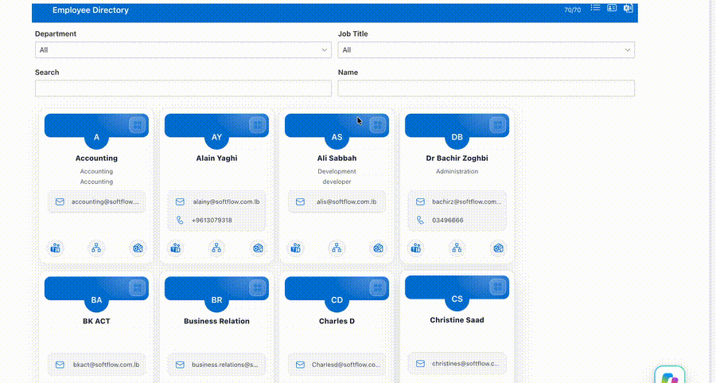

# SF Employee Directory Web Part

## Summary

This SharePoint Framework web part displays a modern employee directory for Microsoft 365 users. It pulls employee data from Microsoft Graph, supports multiple viewing modes, and provides search, filtering, export, QR code generation, and organization chart navigation for quick access to contact and reporting information.

## Web Part Demo



## Used versions

| Tool                            | Version                                                                                    |
| ------------------------------- | ------------------------------------------------------------------------------------------ |
| SharePoint Framework (SPFx)     | 1.19.0                                                                                     |
| @microsoft/generator-sharepoint | 1.19.0                                                                                     |
| Node.js                         | 18.20.4 (project generated with this version; package engine supports `>=18.17.1 <19.0.0`) |
| Gulp                            | 4.0.2                                                                                      |
| TypeScript                      | 4.7.4                                                                                      |
| React                           | 17.0.1                                                                                     |

## Applies to

- [SharePoint Framework](https://aka.ms/spfx)
- [Microsoft 365 tenant](https://docs.microsoft.com/en-us/sharepoint/dev/spfx/set-up-your-developer-tenant)
- [Microsoft Graph](https://learn.microsoft.com/en-us/graph/)

> Get your own free development tenant by subscribing to the [Microsoft 365 Developer Program](http://aka.ms/o365devprogram).

## Prerequisites

Before running the solution locally, make sure you have:

- Node.js 18.x (recommended: 18.20.4)
- npm
- A Microsoft 365 developer tenant or SharePoint Online environment
- A modern browser for local workbench testing

## Solution

| Solution     | Details                                   |
| ------------ | ----------------------------------------- |
| Project Name | SF Employee Directory Web Part            |
| Type         | SharePoint Framework client-side web part |
| Data Source  | Microsoft Graph /directory users API      |

## Features

This web part includes the following capabilities:

- Employee directory powered by Microsoft Graph
- List and profile layout modes
- Department, job title, name, and full-text search filters
- Pagination for large user lists
- CSV export of the currently filtered employee list
- Profile photos with initials fallback when image is unavailable
- Quick actions for:
  - sending mail
  - opening Teams chat
  - opening Outlook compose
  - viewing user profile information
- QR code generation for employee contact cards
- QR code download and sharing support
- Organization chart modal for manager hierarchy navigation
- Theme-aware Fluent UI styling

## How it works

The web part performs the following steps when it loads:

1. Requests user data from Microsoft Graph using the SPFx MSGraphClientV3 factory.
2. Loads employee profile photos where available.
3. Builds manager relationships and prepares the employee hierarchy.
4. Renders the directory in either list view or profile view.
5. Applies filters and pagination on the client side.
6. Allows exporting or sharing employee data in a user-friendly format.

## Minimal path to awesome

1. Clone this repository.
2. Open the solution folder in a terminal.
3. Run the following commands:

```bash
npm install
gulp serve
```

4. Open the SharePoint Workbench or a SharePoint page where the web part is deployed.

## Build and package commands

```bash
npm install
gulp build
gulp bundle
gulp package-solution
```

## Version history

| Version | Date               | Comments                                                              |
| ------- | ------------------ | --------------------------------------------------------------------- |
| 1.0     | September 14, 2026 | Updated README with current project functionality and version details |

## Disclaimer

**THIS CODE IS PROVIDED _AS IS_ WITHOUT WARRANTY OF ANY KIND, EITHER EXPRESS OR IMPLIED, INCLUDING ANY IMPLIED WARRANTIES OF FITNESS FOR A PARTICULAR PURPOSE, MERCHANTABILITY, OR NON-INFRINGEMENT.**

## References

- [Getting started with SharePoint Framework](https://learn.microsoft.com/en-us/sharepoint/dev/spfx/set-up-your-developer-tenant)
- [SharePoint Framework overview](https://learn.microsoft.com/en-us/sharepoint/dev/spfx/sharepoint-framework-overview)
- [Use Microsoft Graph in your solution](https://learn.microsoft.com/en-us/sharepoint/dev/spfx/web-parts/get-started/using-microsoft-graph-apis)
- [Microsoft 365 Patterns and Practices](https://aka.ms/m365pnp)
